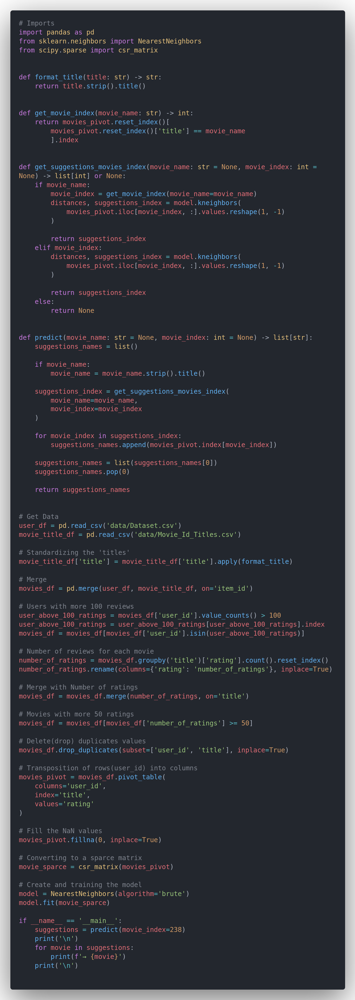
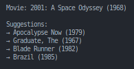
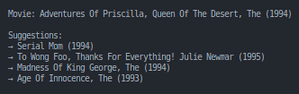
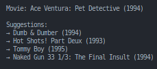

<h1 align="center">Movie Recommender System</h1>

---

### Movie Recommendation System, resources used:
- [Python]('https://www.python.org/') (Programming Language)resources
- [Pandas]('https://pandas.pydata.org/') (Library)
- [Scipy]('https://scipy.org/) (Library)
- [Scikit-Learn]('https://scikit-learn.org/stable/') (Library)
- [Movie Recommendation System]('https://www.kaggle.com/datasets/dev0914sharma/dataset') (Dataset)

---
### Installing the necessary dependencies

`pip install -r requirements.txt`

---

<h3 align='center'>Code</h3>

<h3 align='center'>Some Recommendations made by the algorithm</h3>

